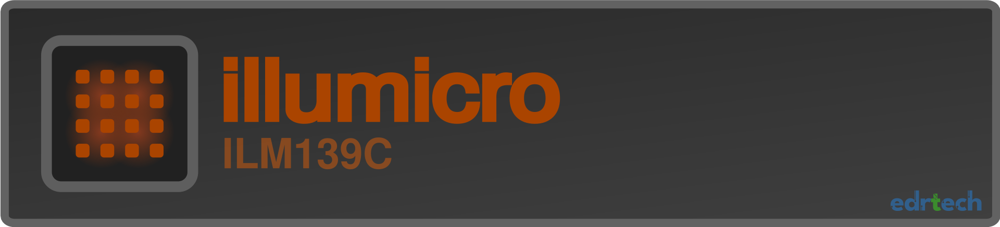

&nbsp;
&nbsp;
&nbsp;
---------------------------------------------------------------------------------
> [!WARNING]
> 

> This project is currently under active development. It is experimental, untested, and may not function as intended. Use at your own risk.
> 
>

---------------------------------------------------------------------------------
# Illumicro ILM139C 13x9 RGB LED matrix

ILM139C Is an RGB LED module with a matrix of 13x9 RGB LEDs.
It is based on the IS31FL3741A LED matrix driver, which provides an i2c interface for full control of
individual LEDs which is accessible with a standard QWIIC connector. 
QWIIC Connector allows for up to 4 modules to be connected together on a single i2c bus.
Small form factor of 26mm*18mm and 2mm pitch of LEDs allows for creating small 
high density and high brightness displays.

&nbsp;
&nbsp;
&nbsp;
&nbsp;
&nbsp;
&nbsp;
&nbsp;
&nbsp;
&nbsp;
&nbsp;

# Features
&nbsp;
&nbsp;
&nbsp;
&nbsp;
&nbsp;

  
- Very small footprint of 26mm*18mm
- 13x9 RBG LED matrix
- 1mm*1mm LEDs, with 2mm pitch
- IS31FL3741A Driver
- 2.7V~5.5V Operating voltage
- QWIIC Connector
- Selectable i2c address
- Removable driver/matrix boards
- Separate power supply connector
  

&nbsp;
&nbsp;
&nbsp;

---------------------------------------------------------------------------------

  
  
  
  

---------------------------------------------------------------------------------
&nbsp;
&nbsp;
&nbsp;

# ILM139C Module pinout

  

---------------------------------------------------------------------------------

# Installation and set up

Connect QWIIC cable to one of the available connectors on the bottom of the module. If you want to power the module over QWIIC, the jumper resistor should be soldered on the bottom of the module. If the jumper is present, DO NOT connect external power supply as it will short to 3.3V of the QWIIC!
The module can be programmed over i2c, a library is currently under development to allow straightforward integration with and i2c capable device.

&nbsp;
&nbsp;
&nbsp;

